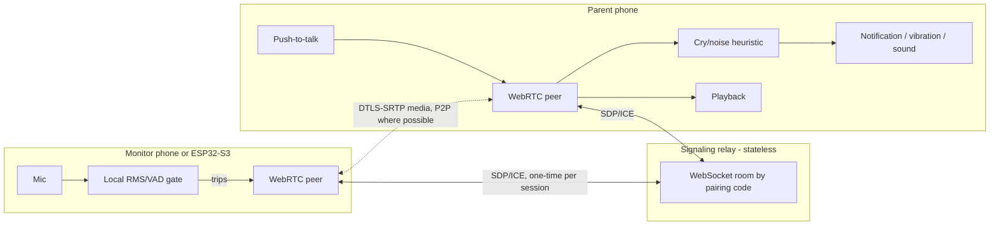

# Wewe — plan

A baby monitor (à la Dormi) built with React Native/Expo + Material Design (styled like
`../DriveWell`), audio-only. Either a phone or a purpose-built ESP32-S3 hardware unit can
be the "Monitor"; a phone is always the "Parent". Both monitor types are WebRTC peers, so
the Parent app's playback path is identical regardless of which kind of monitor it's
talking to. Works on the same WiFi network and remotely, over the open internet, with the
only server-side infrastructure being a small stateless WebRTC signaling relay (no media
relay, no database, no accounts).

## Confirmed scope decisions

1. **Audio-only.** No video. Keeps the phone-monitor and ESP32-monitor at full feature
   parity — an ESP32 mic board can never do video, and Dormi-parity video would fork the
   codebase into two unequal monitor types. Matches the literal ask ("a microphone can be
   used as the monitor").
2. **WebRTC end-to-end**, not a custom protocol. `react-native-webrtc` on both phone roles;
   Espressif's `esp-webrtc-solution` (`esp_webrtc`/`esp_peer`/`esp_capture`) on the ESP32-S3.
   DTLS-SRTP gives media encryption for free — no bespoke crypto to design or audit.
3. **Remote access ships in v1**, using public STUN only (no TURN). Explicit, accepted
   limitation: carrier-grade NAT on either end (common on cellular) can make STUN-only ICE
   fail; TURN is a documented future add-on (Phase 6), not blocking v1.
4. **Streaming is noise-gated at the source.** The monitor (phone or ESP32) runs a cheap
   adaptive RMS/energy VAD locally and only opens/streams the WebRTC audio track when it
   trips, closing it again after a quiet timeout. Saves bandwidth and battery on both ends
   and avoids transmitting nursery audio 24/7 for privacy. A second, more tunable
   cry/noise heuristic then runs on the **Parent** side against the audio that *does*
   arrive, to decide whether to actually alert — kept separate from the gate so alert
   sensitivity is adjustable without touching firmware.

## Correction versus the "ESPHome device" framing

There is no ESPHome (the YAML/C++ codegen framework) component that embeds a WebRTC/ICE/
DTLS-SRTP stack — nothing in the ESPHome ecosystem does on-device WebRTC today; the
closest community projects ("esphome-intercom" and similar) actually bridge raw UDP PCM
into **go2rtc running on Home Assistant**, which is a different architecture and requires
Home Assistant as a backend, which we don't want. Real on-device WebRTC on an ESP32 means
Espressif's own `esp-webrtc-solution`, which is an **ESP-IDF component**, not something
addressable from ESPHome's YAML. So the hardware unit's firmware is a standalone ESP-IDF
application, not an ESPHome YAML config — we lose ESPHome's dashboard/OTA-web-UI/Wi-Fi
captive-portal convenience and rebuild the equivalents ourselves with plain ESP-IDF
components (below). This is flagged as the highest-risk, highest-effort workstream and is
deliberately the last phase, built only once the phone-only product is proven.

## Architecture



Once ICE completes, media flows peer-to-peer (or through the browser/OS's own STUN-derived
path); the relay only ever sees SDP/ICE blobs, never audio.

## Repo layout

```
src/
  domain/        pure TS: VAD/energy-gate algorithm, cry/noise heuristic, pairing-code
                 generation/validation, activity-log entry model. No React/Expo imports —
                 Jest in plain Node, same rule as DriveWell's src/domain.
  webrtc/        peer-connection lifecycle (create/renegotiate/close), signaling client
                 (WebSocket to the relay), ICE/connection-state → domain events.
  platform/      mic level-metering tap (expo-av metering, used only to drive the VAD —
                 the actual audio track comes from react-native-webrtc's getUserMedia),
                 mDNS local discovery (react-native-zeroconf), foreground-service +
                 notification/vibration dispatch, confirm/alert dialogs.
  screens/       ModeSelect, Monitor (level meter, pairing code + QR, mute/stop),
                 Parent (live status, talk-back button, mute, activity log, per-monitor
                 connection state), AddMonitor (scan QR / enter code / mDNS list),
                 Settings (signaling server URL, gate sensitivity, alert prefs).
  storage/       expo-sqlite: activity log (timestamped noise/cry/connection events),
                 paired-monitor list (label + last-known pairing code). Local only,
                 uninstall wipes it — stated plainly, same as DriveWell.
  theme.ts       react-native-paper MD3 theme generated from one seed color via
                 @material/material-color-utilities, same pattern as DriveWell/src/theme.ts.
App.tsx          PaperProvider + navigation, store bootstrap, error screen.

signal-server/   ~150-line stateless WebSocket relay: pairing-code rooms, forwards SDP/ICE
                 JSON between exactly two sockets, no persistence, no accounts. Ships as an
                 independent, self-hostable, Docker-packaged component; app Settings screen
                 lets a user point at their own instance instead of the default one.

firmware/        Standalone ESP-IDF app (ESP32-S3) using esp-webrtc-solution components:
                 I2S mic capture (esp_capture), Opus encode, on-device RMS gate, WebRTC
                 peer (esp_peer/esp_webrtc), Wi-Fi provisioning (wifi_provisioning,
                 SoftAP + captive portal), OTA via esp_https_ota against GitHub Releases.
```

## Key technical decisions

- **Expo SDK 57 / RN 0.86 / TypeScript**, same pinned stack as DriveWell, for one
  consistent toolchain across sibling projects.
- **Not Expo-Go-compatible.** `react-native-webrtc` requires custom native code —
  `@config-plugins/react-native-webrtc` + `expo prebuild` + a dev client, same
  prebuild-based Android target DriveWell already uses.
- **VAD gate is pure, deterministic, adaptive-threshold RMS/energy** (no ML), implemented
  once in `src/domain` and ported line-for-line to the firmware's C — the two
  implementations must agree on behavior; document the algorithm once, reference it from
  both.
- **Cry/noise alert heuristic lives on the Parent side**, not the monitor, so alert
  sensitivity and (later) an ML classifier can be tuned/upgraded without re-flashing
  ESP32 firmware.
- **Pairing code is both the signaling room name and a shared secret**: rotated per
  monitor session, shown as text + QR, short-lived/HMAC-signed so a guessed room can't
  receive another user's SDP offer. mDNS (`react-native-zeroconf`) is UX sugar for
  same-LAN discovery only — the transport is always WebRTC regardless of LAN or remote.
  media requires no separate encryption story.
- **STUN only in v1** (e.g. public Google STUN); TURN (coturn, self-hostable) documented
  as an explicit Phase 6 add-on for CGNAT cases, not built now.
- **Background reliability**: foreground service + persistent notification on both roles
  (Android requirement to keep mic/socket alive, screen off); `oniceconnectionstatechange`
  drives the connection-loss alarm — matches Dormi's connection-loss alarm, purely
  client-side.
- **Hardware target: ESP32-S3 with PSRAM** (not classic ESP32/ESP8266/C3) — DTLS-SRTP +
  Opus encode is compute/RAM-heavy; Espressif's own WebRTC demos target S3.

## Phased delivery

**Phase 0 — Scaffold.** Mirror DriveWell's tooling: `mise.toml`, `Makefile`, `jest.config`,
`tsconfig`, `app.json`, `theme.ts` (new seed color), F-Droid/GitHub-release skeleton.

**Phase 1 — Phone-to-phone MVP (LAN + relay, always-on streaming).** Pairing (code/QR +
mDNS), `signal-server` v0, WebRTC audio Monitor→Parent, live playback, level meter,
push-to-talk, basic connection status. No gating yet — prove the media path first.

**Phase 2 — Noise-gating + alerting.** Domain VAD gate wired into the Monitor's track
start/stop; Parent-side cry/noise heuristic drives vibration/notification/sound alerts;
activity log persistence; connection-loss alarm; foreground-service hardening.

**Phase 3 — Remote-access hardening.** Harden `signal-server` (pairing-code
signing/expiry, reconnect/backoff), Settings UI for a custom relay URL, STUN config,
real-network testing across two separate ISPs/NATs.

**Phase 4 — ESP32-S3 firmware.** ESP-IDF + esp-webrtc-solution integration, I2S mic
capture, on-device RMS gate ported from `src/domain`, Wi-Fi provisioning captive portal,
pairing-code entry, OTA via GitHub Releases. Highest risk/effort phase; only start once
Phases 1–3 validate the product end to end on phones alone.

**Phase 5 — Parity polish.** Multi-monitor support (Dormi²/Dormi³-style "add another
monitor" list instead of separate apps), optional ambient-temperature display if the
ESP32 board has a sensor, sensitivity settings, F-Droid + GitHub Releases pipeline
(mirroring DriveWell's `Makefile`/`.github/workflows`), documentation.

**Phase 6 — Explicit stretch, not committed.** TURN fallback for CGNAT; on-device TFLite
cry classifier to replace/augment the RMS heuristic; talk-back playback on the ESP32 unit
(requires optional onboard speaker/amp hardware, most mic-only boards don't have one).

## Open items to settle before Phase 0 begins

- ~~App display name / package id / F-Droid distribution target~~ — resolved: `Wewe` /
  `xyz.hub13.wewe`, its own new F-Droid target (not DriveWell's).
- ~~Default public signaling-relay hosting~~ — resolved: the project maintainer runs
  `wss://wewe-api.hub13.xyz` as the app's default (`DEFAULT_SIGNALING_SERVER_URL`),
  overridable in Settings.
- Specific ESP32-S3 dev board + I2S mic part number to standardize the BOM against.
